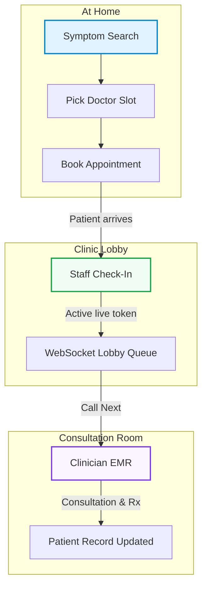

# 🏥 Aarogya — India's End-to-End Healthcare Coordination Platform

🔗 Live Demo: https://aarogya.vercel.app
📦 GitHub: https://github.com/Mayankb125/Aarogya.git

*Find the right doctor, book your slot, walk in, get seen. Aarogya handles the rest.*

Aarogya is an end-to-end digital healthcare and lobby coordination platform designed to eliminate waiting room friction. By connecting symptom-based doctor discovery, dynamic calendar slot booking, receptionist-led check-in, real-time WebSocket token coordination, and clinician EMR dashboards, Aarogya provides a seamless experience for patients, clinic staff, and practitioners.

---

## 💡 The Core Workflow

Aarogya bridges the gap between digital appointment booking at home and physical queue management in the lobby:



---

## 🚀 Key Features

### 👤 Patient Portal (Discovery & Pre-Consultation)
*   **Symptom-to-Specialty Mapping**: Fuzzy-matches natural language symptom entries (e.g. *"heartburn"*) into official clinical domains (e.g. *Cardiology*).
*   **Dynamic Practice Calendars**: Provides live slot booking tailored to practitioner schedules.
*   **Interactive Onboarding**: Patients fill in their allergies, chronic conditions, and contact details.
*   **Rx History**: Access to historical prescriptions, diagnoses, clinical notes, and follow-up reminders.

### 📋 Receptionist Panel (Lobby Command Center)
*   **Digital Check-In**: One-click confirmation converts pending bookings into active queue tokens upon patient arrival.
*   **Queue Control**: Advancement controls (**Call Next**), bulk resets, and manual walk-in registration.
*   **Lobby Casting Mode**: Casts a clean, high-contrast display monitor showing the token currently being served and the waiting list.

### 🩺 Clinician Workspace (EMR & Dashboard)
*   **Pre-Consult Context**: Toggles age, blood group, last visit summaries, and prior clinical reports before a patient enters.
*   **Live Call Next Action**: Clinicians pull patients in sequentially, triggering lobby screens to flash and ring.
*   **Consultation Logging**: Log diagnoses, write active drug prescriptions (Rx), and schedule automated follow-up reminders in real-time.

### 👑 Administrator Console
*   **Clinic Onboarding**: Manage, activate, or temporarily hide doctors and medical centers in the registry.
*   **Schedule Customization**: Define custom clinic timings, coordinates, consultation fees, and weekly slot frequencies.

---

## 🛠️ Tech Stack

### Frontend
*   **Core**: React.js, React Router
*   **Styling**: Tailwind CSS
*   **WebSocket Client**: Socket.IO Client (encapsulated in Promise-driven action wrappers)
*   **Build Tool**: Vite

### Backend
*   **Runtime**: Node.js, Express.js
*   **WebSocket Server**: Socket.IO
*   **Authentication**: Firebase Admin SDK (token validation)

### Database Layer (Dynamic Fallback Chain)
*   **Primary Cloud Database**: Appwrite Cloud NoSQL Collections (Bookings, Patients, Doctors, Hospitals, Queues). Appwrite was chosen as the primary database for its built-in role-based permissions, real-time collection subscriptions, and generous free cloud tier which eliminates DevOps overhead during early product development.
*   **Secondary Option**: Firebase Firestore Collections
*   **Local Fallback**: In-Memory JavaScript Database (ideal for sandboxed offline testing)

---

## 🔑 Test Credentials

Use these credentials to evaluate the role-based workflows:
```
Patient account:    patient@aarogya.in   / password: test1234
Doctor account:     doctor@aarogya.in    / password: test1234
Receptionist PIN:   1234
Admin account:      admin@aarogya.in     / password: test1234
```

---

## 🔌 WebSocket Event Reference

The synchronization engine establishes real-time message streams between the receptionist desk, lobby monitors, and doctor panels:

```
CLIENT (Receptionist / Doctor)       SERVER (Socket.IO Hub)           CLIENT (Lobby Display)
        |                                   |                                   |
        |--- patient:add / callNext ------->|-- updates DB                      |
        |    (payload containing ID)        |-- broadcast: queue:updated ------>| (State updates)
        |                                   |   (syncs lobby counts & times)    |
        |                                   |                                   |
        |                                   |-- broadcast: token:called ------->| (Flash monitor &
        |                                   |   (contains target token)         |  trigger chime alert)
        |                                   |                                   |
        |--- queue:sync ------------------->|                                   |
        |<-- queue:state -------------------| (Fired on fresh connection)       |
```

---

## 📂 Project Directory Structure

```
aarogya/
├── backend/                             # Node.js Express Server
│   ├── config/
│   │   ├── appwrite.js                 # Appwrite Cloud SDK config
│   │   ├── firebase.js                 # Firebase Admin certification rules
│   │   └── roles.js                    # Role verification definitions
│   ├── data/
│   │   └── phase2Seed.js               # Offline mock fallback dataset
│   ├── middleware/
│   │   ├── auth.js                     # Express auth router & token verifier
│   │   └── errorHandler.js             # Global backend error handler
│   ├── routes/
│   │   ├── admin.js                    # Clinic registry CRUD routes
│   │   ├── auth.js                     # Token session metadata validation
│   │   ├── bookings.js                 # Appointment creation & confirmation routes
│   │   ├── doctors.js                  # Doctor scheduling dashboard queries
│   │   ├── hospitals.js                # Healthcare center locator routes
│   │   ├── patients.js                 # Profile updates & clinical prescriptions
│   │   ├── queue.js                    # REST queue controls for testing
│   │   └── symptoms.js                 # Symptom matching rule engine
│   ├── services/
│   │   ├── queueService.js             # Queue operations (Firestore transactions)
│   │   ├── bookingService.js           # Pre-booking, check-in, and confirmations
│   │   └── ...                         # Doctor/Hospital/Patient services
│   ├── sockets/
│   │   └── socketManager.js            # WebSocket setup and connection routing
│   └── server.js                       # HTTP server bootstrap entry point
│
└── frontend/                            # Vite React App
    ├── src/
    │   ├── assets/
    │   ├── discovery/                  # Doctor directory & slot booking page components
    │   ├── pages/
    │   │   ├── LandingPage.jsx         # Launch page with demo widgets
    │   │   ├── ReceptionistPage.jsx    # PIN-gated receptionist command panel
    │   │   ├── WaitingRoomPage.jsx     # Live castable lobby TV monitor page
    │   │   ├── DoctorDashboardPage.jsx # Clinician patient overview panel
    │   │   ├── DoctorPatientDetailPage.jsx # Consultation EMR checkup sheet
    │   │   └── ...
    │   ├── shared/
    │   │   ├── components/             # Reusable UI components (Headers, Badges, Shells)
    │   │   ├── context/
    │   │   │   └── AuthContext.jsx     # State manager for Firebase / Dev Auth
    │   │   ├── hooks/
    │   │   │   └── useQueue.js         # Custom hook for real-time WebSocket state mapping
    │   │   └── services/
    │   │       ├── api.js              # Axios client with interceptors for bearer tokens
    │   │       └── socketService.js    # Global Socket.IO client interface
    │   ├── App.jsx                     # Route paths mapping
    │   ├── main.jsx                    # React index DOM mount
    │   └── index.css                   # Global CSS rules (Tailwind setup)
```

---

## ⚙️ Setup & Installation

### 1. Clone the Project
```bash
git clone https://github.com/Mayankb125/Aarogya.git
cd aarogya
```

### 2. Configure Environment Variables

Create a `.env` file in **both** the backend and frontend folders.

#### Backend (`backend/.env`)
```env
PORT=5000
CLIENT_URL=http://localhost:5173

# Firebase configuration (Leave blank if using Appwrite or In-Memory fallback)
FIREBASE_SERVICE_ACCOUNT=./serviceAccountKey.json

# Appwrite configuration (Optional)
APPWRITE_ENDPOINT=https://cloud.appwrite.io/v1
APPWRITE_PROJECT_ID=your_project_id
APPWRITE_API_KEY=your_api_key
APPWRITE_DATABASE_ID=aarogya_db

# Local Dev Mock configuration (When auth is bypassed)
DEV_MOCK_EMAIL=dr-priya-sharma@aarogya.in
```

#### Frontend (`frontend/.env`)
```env
VITE_SOCKET_URL=http://localhost:5000

# Firebase web credentials (Optional - needed if live authentication is used)
VITE_FIREBASE_API_KEY=your_api_key
VITE_FIREBASE_AUTH_DOMAIN=your_project.firebaseapp.com
VITE_FIREBASE_PROJECT_ID=your_project_id
VITE_FIREBASE_STORAGE_BUCKET=your_project.appspot.com
VITE_FIREBASE_MESSAGING_SENDER_ID=your_sender_id
VITE_FIREBASE_APP_ID=your_app_id
```

### 3. Install Dependencies & Launch

#### Setup Backend
```bash
cd backend
npm install
npm run dev
```

#### Setup Frontend
```bash
cd ../frontend
npm install
npm run dev
```

Open:
*   Patient Hub: `http://localhost:5173/`
*   Receptionist Dash (PIN: `1234`): `http://localhost:5173/receptionist`
*   Lobby Screen: `http://localhost:5173/waiting`
*   Doctor Portal (Dev Mode Auth): `http://localhost:5173/doctor/dr-priya-sharma/dashboard`
    *   *Note: `dr-priya-sharma` is a pre-seeded developer profile loaded from `phase2Seed.js`. In production environments, this route utilizes secure Firebase Authentication token validation.*

---

## 🧠 Core Engineering Principles

### 1. Double Booking Prevention
When two patients attempt to book the same slot simultaneously, Aarogya prevents double booking at the database level:
*   **Appwrite (Primary Cloud Database)**: A Unique Index Constraint is enforced on the `slotId` attribute of the `bookings` collection. Any concurrent write attempting to record the same slot ID will trigger a database-level conflict, throwing a conflict exception and automatically rolling back the second booking attempt.
*   **Firestore (Secondary Cloud Database)**: The application executes transactions to run atomic read-modify-write operations on the doctor's slot availability. If a concurrent write is committed between the transaction's read and write phases, the transaction automatically fails, rolls back, and instructs the client to select another slot.
*   **Local Fallback**: Memory state uses synchronous JavaScript execution which prevents race conditions on booking storage.

### 2. Disconnection Resilience
Clients (e.g., lobby TVs) might experience temporary network drops. Socket.IO implements exponential backoff to reconnect, and the client auto-triggers a `queue:sync` event to fetch a fresh state snapshot immediately upon reconnection, avoiding stale or out-of-sync UI states.

### 3. Progressive Enhancement / Fallback Databases
To make local developer setup fast, database engines are plug-and-play. If Appwrite environment parameters are missing, the system searches for Firebase service accounts. If those are missing as well, it silently spins up an in-memory repository populated with structured seeds ([phase2Seed.js](file:///d:/Medical/backend/data/phase2Seed.js)) so the application remains functional.

---

## 📝 Submission Notes

### One improvement with more time
"With more time, I would implement real-time slot availability updates using WebSocket broadcasts so that when a slot gets booked by one patient, all other patients currently viewing the same doctor's profile see that slot go gray instantly without needing to refresh the page."

### One feature intentionally left out and why
"Payment integration was intentionally left out. Integrating a payment gateway would require PCI compliance handling and significantly increase setup complexity for reviewers. The booking flow is designed to accept payment as a plugin middleware step between slot confirmation and booking ID generation."
